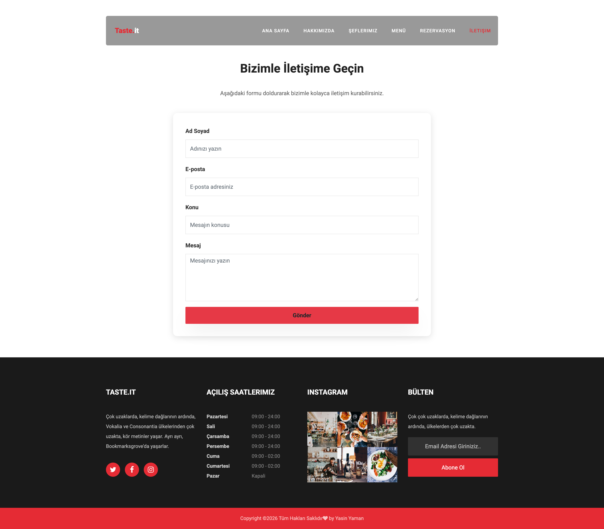
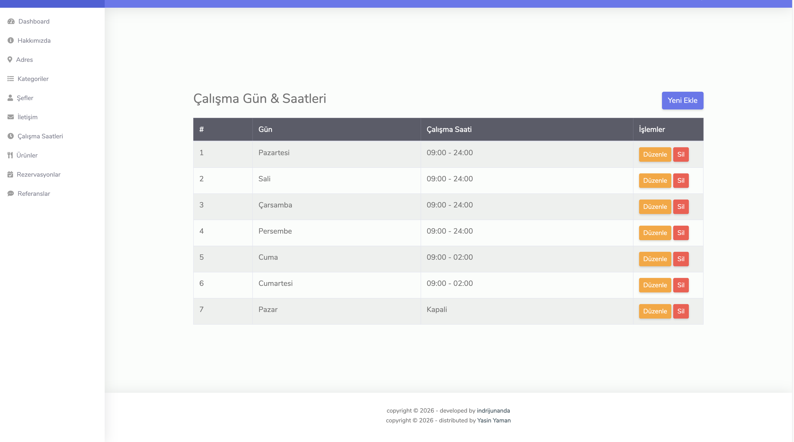
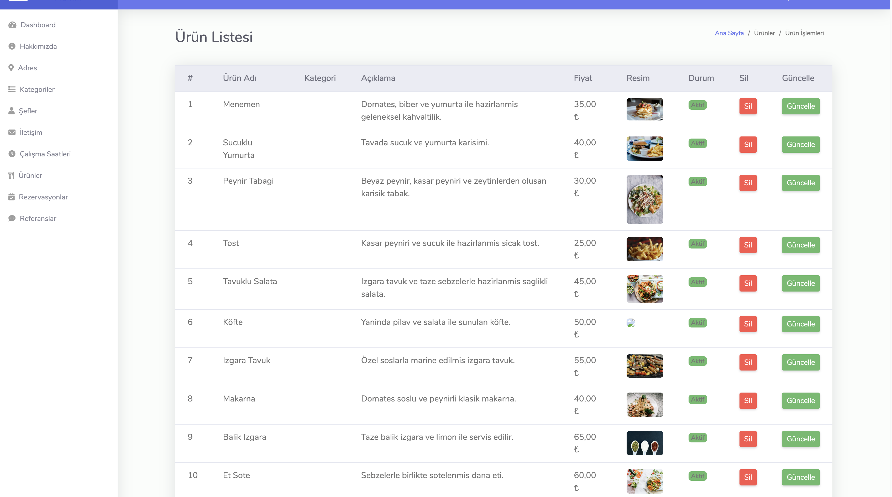
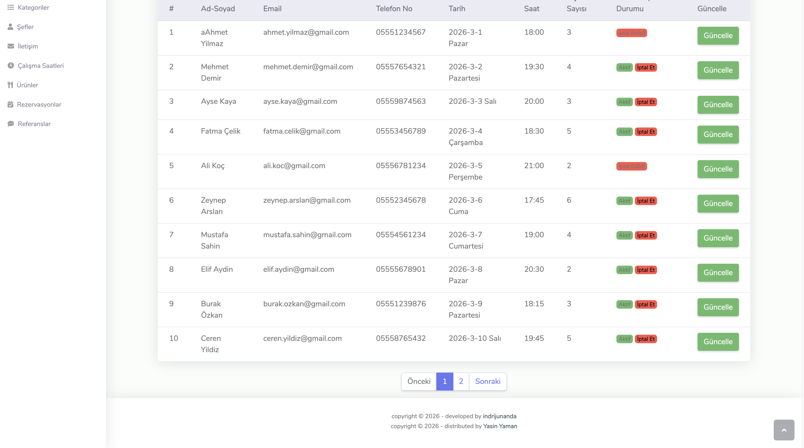
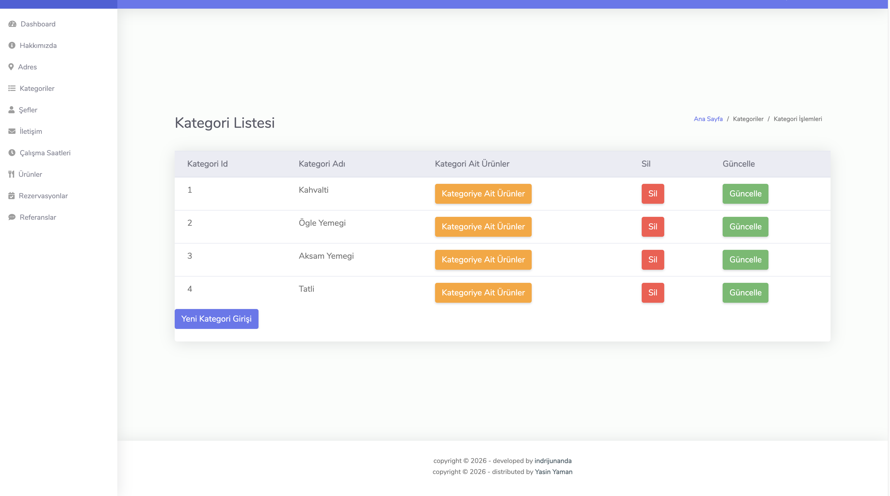
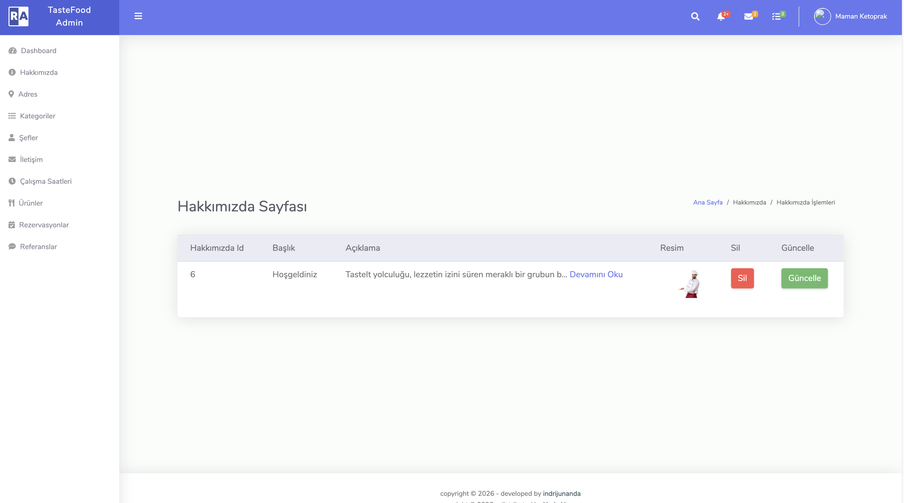
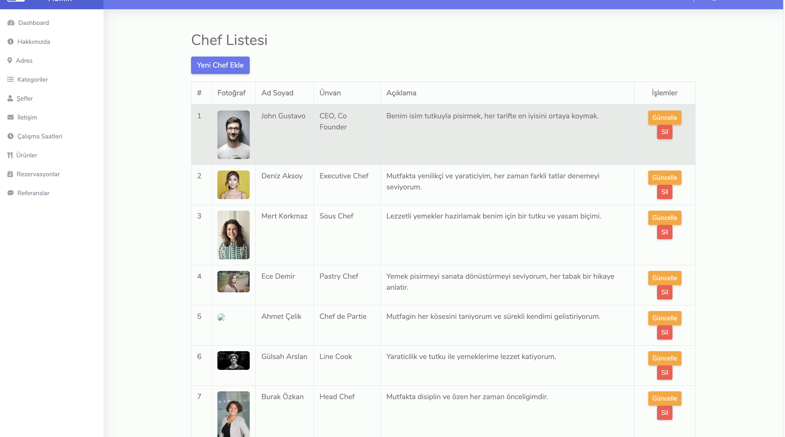

# 🍽 Restaurant Management & Reservation System

  
  
  

Modern ve kullanıcı dostu bir **Restoran Yönetim ve Rezervasyon Sistemi**.  
Kullanıcılar rezervasyon oluşturabilir, admin panel üzerinden tüm içerik yönetilebilir.

---

# 🚀 Proje Özellikleri

- ✅ Online rezervasyon sistemi  
- ✅ Dinamik menü yönetimi  
- ✅ Admin panel kontrol sistemi  
- ✅ Açık gün & saat ayarlama  
- ✅ Kategori ve şef yönetimi  
- ✅ Responsive tasarım  

---

# 📱 Kullanıcı Arayüzü (UI)

## 🏠 Ana Sayfa

Restoran hakkında genel bilgilerin bulunduğu giriş ekranıdır.  
Menü, rezervasyon ve iletişim sayfalarına yönlendirme içerir.

---

## 📞 İletişim Sayfası

Adres, telefon, e-posta ve mesaj gönderme formunun bulunduğu iletişim ekranıdır.

---

# 🔧 Admin Paneli

## ⏰ Açık Gün & Saat Yönetimi

Restoranın çalışma gün ve saatleri bu panel üzerinden düzenlenir.

---

## 🍽 Menü Yönetimi

Menü öğeleri eklenebilir, güncellenebilir ve silinebilir.

---

## 📅 Rezervasyon Yönetimi

Müşteri rezervasyonları görüntülenir ve yönetilir.

---

## 📂 Kategori Yönetimi

Menü kategorileri (Ana Yemek, Tatlı, İçecek vb.) buradan düzenlenir.

---

## ℹ Hakkımızda Yönetimi

Restoran hakkında bilgiler admin panel üzerinden güncellenebilir.

---

## 👨‍🍳 Şef Yönetimi

Şef bilgileri ve içerikleri yönetilir.

---

# 🛠 Kullanılan Teknolojiler

| Katman      | Teknoloji |
|------------|------------|
| Frontend   | React / HTML / CSS / JavaScript |
| Backend    | ASP.NET Core / Node.js |
| Database   | SQL Server / MySQL |

